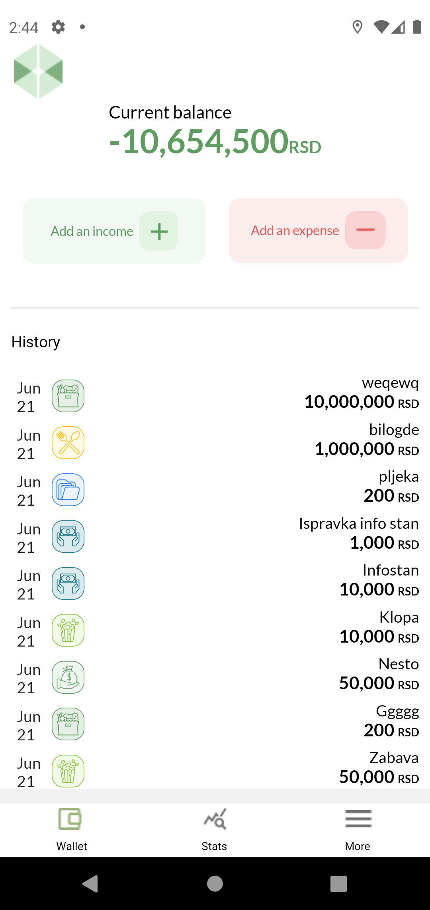
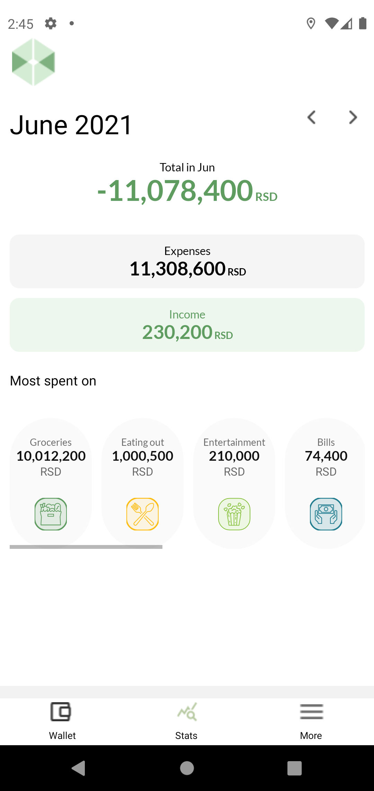
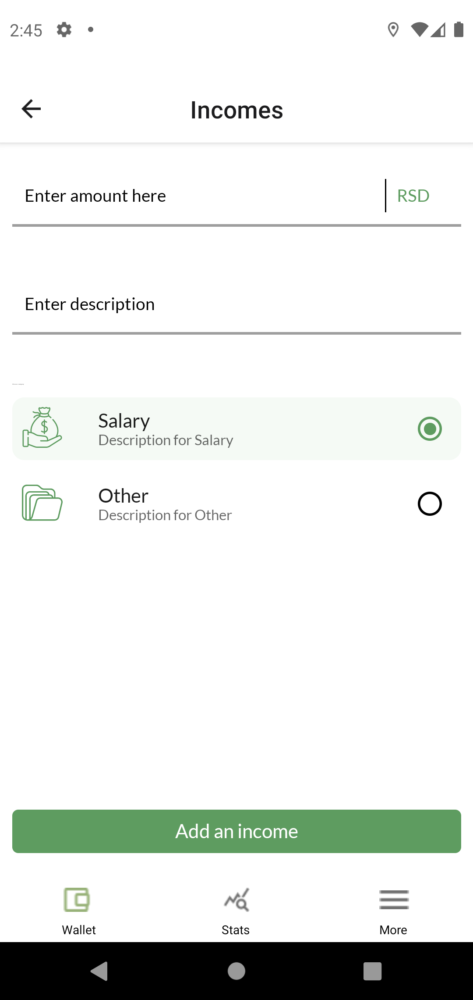
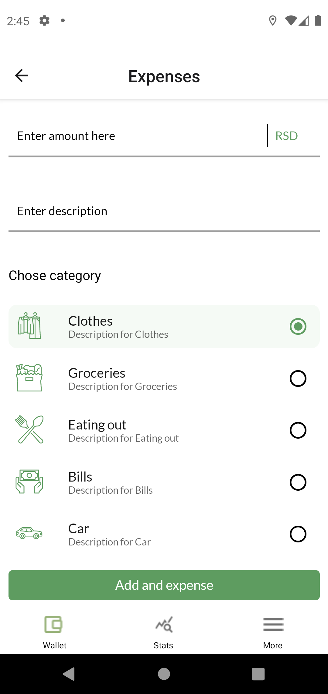
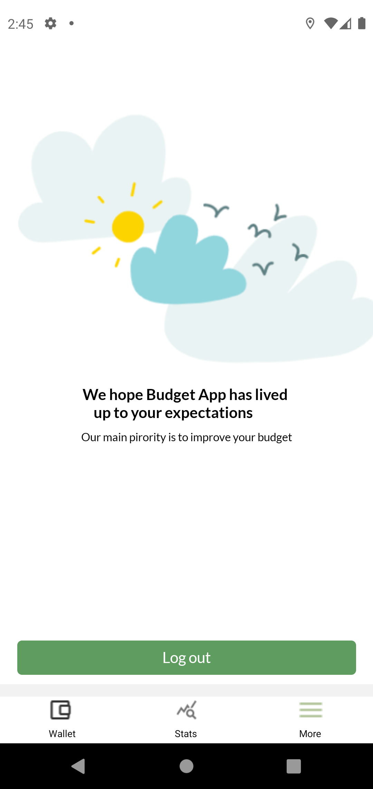

<h1 align="center">BudgetApp - React native application</h1>

  
   
  <i>Home screen of application, shows current balance , history of expenses and buttons to add new expense or income </i>
   

  
   
  <i>Statistics page can show difference between spent/earned money in picked Month. Also got Most Spent On feature and it counts your biggest expenses per category </i>
   

  
   
  <i>Add income screen allows you to fill in your Income Number, Income name and you need to pick Income Category by checking one of radio buttons. </i>
   

  
   
  <i>Add outcome screen allows you to fill in your outcome Number, outcome name and you need to pick Income Category by checking one of radio buttons. </i>
   

  
   
  <i>Logout page </i>
   

